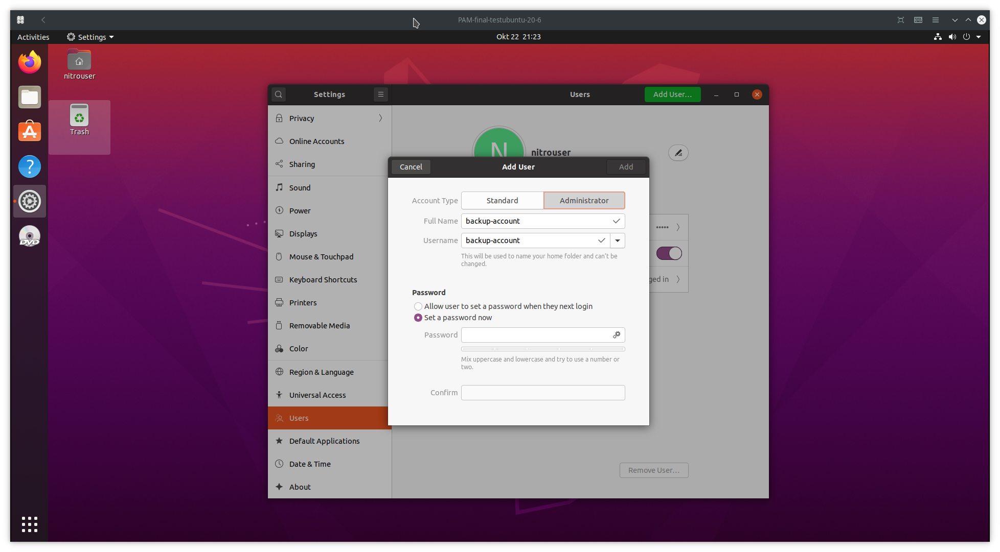
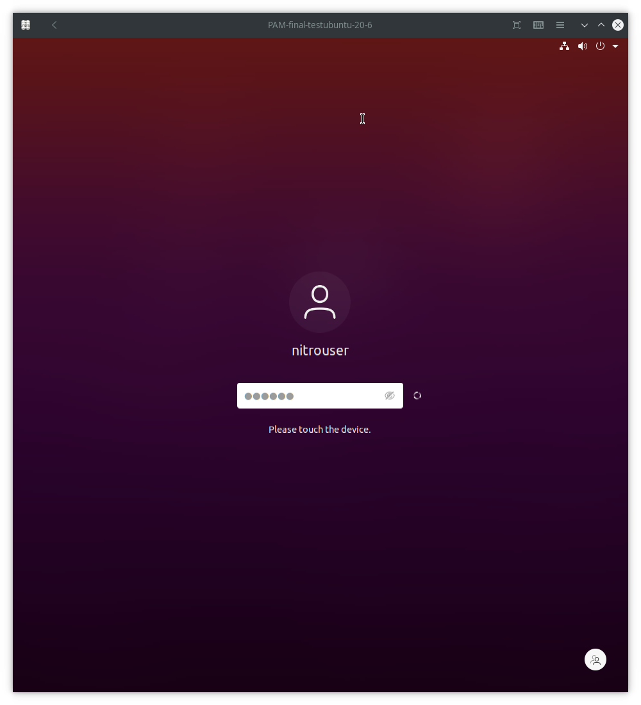

# Desktop Login and Linux User Authentication
## Introduction
This guide will walk you through the configuration of Linux to use FIDO Universal 2nd Factor, i.e. FIDO U2F with `libpam-u2f` and [Nitrokey FIDO2](https://shop.nitrokey.com/shop/product/nk-fi2-nitrokey-fido2-55) .

If you want to login to you computer using [Nitrokey Pro 2,](https://shop.nitrokey.com/shop/product/nk-pro-2-nitrokey-pro-2-3) [Nitrokey Storage 2](https://shop.nitrokey.com/shop/product/nitrokey-storage-2-56) and [Nitrokey Start](https://shop.nitrokey.com/shop/product/nk-sta-nitrokey-start-6) you can visit the instructions for Windows available [here](https://www.nitrokey.com/documentation/applications#computer-login), and for Linux [here](https://www.nitrokey.com/documentation/applications#computer-login) .
### Requirements

- Ubuntu 20.04 with Gnome Display Manager.
- Nitrokey FIDO2 configured following [these instructions](https://www.nitrokey.com/documentation/installation#p:nitrokey-fido-u2f&os:linux).
## Instructions
### Preparation
#### 1. Set up `<backup_user>`
This step is not necessary for the setup, however it is recommended as fall-back if you are testing user-specific instructions.
##### GUI method
1. In the lower left corner click on `Show Applications` and type settings in the search bar as following:


2. Scroll down in the right bar to `Users`


3. In the left corner click on `Unlock` and that would prompt for your password
4. Select `Administrator` and enter the user name and password of your choice 



5. Once you finish Step 4 you should be done


##### CLI method 

Create a backup user, and give it root privileges with these commands:
```bash
$ sudo adduser <backup_user>
$ sudo usermod -aG sudo <backup_user>
```
In case you prefer to setup U2F for a single user, and are locked out of your user session, you would still be able to login with the `<backup_user>`, and proceed with the maintenance. 

::: warning

The following guide can potentially lock you out of your computer. You should be aware of these risks, as it is recommended to first use the instructions below on a secondary computer, or after a full backup. 

You might lose access to your data after configuring [PAM modules](http://www.linux-pam.org/Linux-PAM-html/). 

:::
#### 2. Set up the `rules` to recognize the Nitrokey FIDO2
Under `/etc/udev/rules.d` download `41-nitrokey.rules`
```bash 
$ cd /etc/udev/rules.d/
$ sudo wget https://raw.githubusercontent.com/Nitrokey/libnitrokey/master/data/41-nitrokey.rules
```
And restart `udev` service
```bash
$ sudo systemctl restart udev
```

#### 3. Install `libpam-u2f` 
On Ubuntu 20.04 it is possible to download directly `ibpam-u2f` from the official repos

```bash
$ sudo apt install libpam-u2f
```
::: details Click for more options
- Alternatively you can build `libpam-u2f` from [Git](https://github.com/phoeagon/pam-u2f).
- To verify that the library is properly installed enter the following command:
```bash
$ file /lib/x86_64-linux-gnu/security/pam_u2f.so
```
The Output should be something like the following:
```bash
/lib/x86_64-linux-gnu/security/pam_u2f.so: \ ELF 64-bit LSB shared object, x86-64, version 1 (SYSV),\ dynamically linked, BuildID[sha1]=1d55e1b11a97be2038c6a139579f6c0d91caedb1, stripped
```
:::
#### 4. Prepare the Directory
Create `.config/Nitrokey/` under your home directory
```bash
$ mkdir ~/.config/Nitrokey
```
And plug your Nitrokey FIDO2.
### Configuration
Once done with the preparation, we can start to configure the computer to use the Nitrokey FIDO2 for 2nd factor authentication at login and `sudo`.
#### 5. Generate the U2F config file
To generate the configuration file we will use the `pamu2fcfg` utility that comes with the `libpam-u2f`.
For convenience, we will directly write the output of the utility to the `u2f_keys` file under `.config/Nitrokey`.
First plug your Nitrokey FIDO2 (if you did not already), and enter the following command:

```bash
$ pamu2fcfg > ~/.config/Nitrokey/u2f_keys
```
Once you run the command above, you will need to touch the key while it flashes. Once done, `pamu2fcfg` will append its output the `u2f_keys` in the following format:
```bash
<username>:Zx...mw,04...0a
```
Note, the output will be much longer, but sensitive parts have been removed here. 
For better security, and once the config file generated, we will move the `.config/Nitrokey` directory under the `etc/` directory with this command:

```bash
$ sudo mv ~/.config/Nitrokey /etc	
```
::: tip
- The file under `.config/Nitrokey` must be named `u2f_keys`
- It is recommended to first test the instructions with a single user. For this purpose the previous command takes the `-u` option, to specify a user, like in the example below:
```bash
$ pamu2fcfg -u <username> > ~/.config/Nitrokey/u2f_keys
```
- For individual user configuration you should point to the home directory in the next step, or not include the `authfile` option in the PAM configuration. 
:::
#### 6. Backup
This step is optional, however it is advised to have a backup Nitrokey in the case of loss, theft or destruction of your Nitrokey FIDO. 

To set up a backup key, repeat the procedure above, and use `pamu2fcfg -n`. This will omit the `<username>` field, and the output can be appended to the line with your `<username>` like this:

```
<username>:Zx...mw,04...0a:xB...fw,04...3f
```
#### 7. Modify the Pluggable Authentication Module `PAM`
The final step is configure the PAM module files under `/etc/pam.d/`. 
In this guide we will modify the `common-auth` file as it handles the authentication settings which are common to all services, but other options are possible.
You can modify the file with the following command:
```bash
$ cd /etc/pam.d
$ sudo $editor common-auth
```
And add the following lines:
```bash
#Nitrokey FIDO2 config 
auth	sufficient pam_u2f.so authfile=/etc/Nitrokey/u2f_keys cue prompt 
```
::: tip 
- Since we are using Central Authentication Mapping, we need to tell `pam_u2f` the location of the file to use with the `authfile` option.
- If you often forget to insert the key, `prompt` option make `pam_u2f` print `Insert your U2F device, then press ENTER.` and give you a chance to insert the Nitrokey.
- If you would like to be prompted to touch the Nitrokey, `cue` option will make `pam_u2f` print `Please touch the device.` message.
:::

Once we modified the `common-auth`, we can save and exit the file. 

You can test the configuration by typing `sudo ls` in the terminal. You should be prompted the message `Please touch the device.` and have a similar output on the terminal:

```bash nitrouser@nitrouser:~$ sudo ls
$ sudo ls
[sudo] password for <username>: 
Please touch the device.
```
You can also test your configuration by logging out of the user session and logging back. A similar screen should be displayed once you you unplug/replug yout Nitrokey FIDO2 and type your password:



## Usage
After the PAM module modification, you will be able to test your configuration right away, but it is recommended to reboot your computer, and unplug/replug the Nitrokey FIDO2.

Once you have properly tested the instructions in this guide (and set up a backup), it is recommended to use either the `required` or the `requisite` control flag instead of `sufficient`. 

The flags `required` and `requisite` provide a tighter access control, and will make the Nitrokey FIDO2 necessary to login, and/or use the configured service. 

If you need more information about Control Flags in the `PAM` configuration line, you may see the last section of this guide to understand the difference, and the implications of using each of them. 
#### PAM modules
There are several PAM modules files that can be modified according to your needs:
- By modifying `/etc/pam.d/common-auth` file, you will be able to use you Nitrokey FIDO for 2nd factor authentication for graphic login and `sudo`. 
Note: `common-auth` should be modified by adding the additional configuration line at the end of the file.
- If you wish to use FIDO U2F authentication solely for Gnome's graphic login, you might prefer to modify the`/etc/pam.d/gdm-password` 
- Alternatively you can just modify the `/etc/pam.d/sudo` file if you wish to use FIDO U2F when using the `sudo` command.
#### Control flags
In step 7 we have used the `sufficient` control flag to determine the behavior of the PAM module when the Nitrokey is plugged or not. However it is possible to change this behavior by using the following control flags:
- `required`: This is the most critical flag. The module result must be successful for authentication to continue. This flag can lock you out of your computer if you do not have access to the Nitrokey.
- ` requisite`: Similar to `required` however, in the case where a specific module returns a failure, control is directly returned to the application, or to the superior PAM stack. This flag can also lock you out of your computer if you do not have access to the Nitrokey.
- `sufficient`: The module result is ignored if it fails. The `sufficient` flag considered to be safe for testing purposes. 
- `optional`: The success or failure of this module is only important if it is the only module in the stack associated with this service+type. The `optional` flag is considered to be safe to use for testing purposes. 
  

::: warning

- If `required`  or `requisite` is set, the failure of U2F authentication will cause a failure of the overall authentication. Failure will occur when the configured Nitrokey FIDO is not plugged, lost or destroyed.

- You will lose access to your computer if you mis-configured the PAM module *and* used the `required` or `requisite` flags. 

- You will also lose the ability to use `sudo` if you set up Central Authentication Mapping *and* used the `required` or `requisite` flags.
::: 
