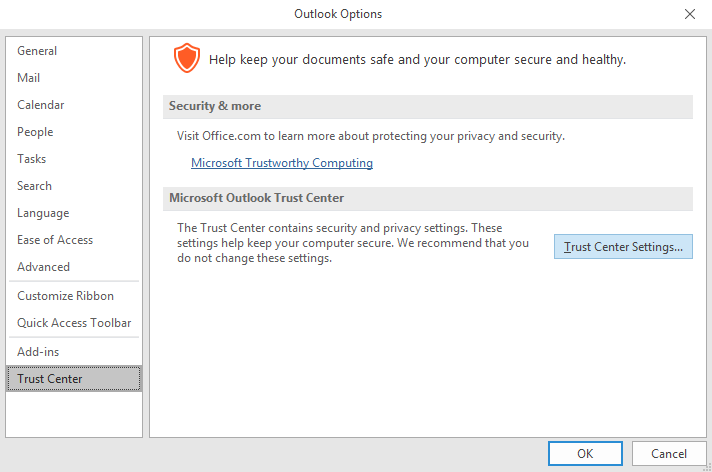
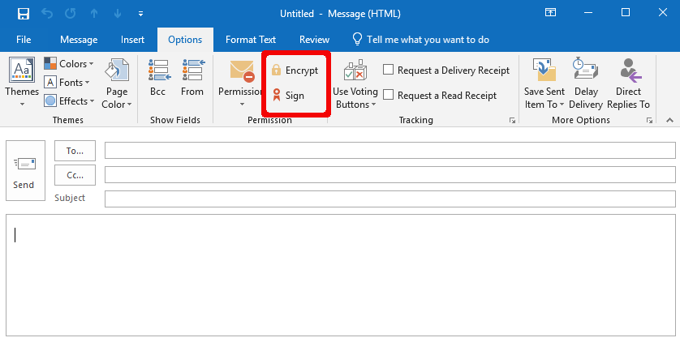

# S/MIME Email Encryption with Outlook

## 

## Prerequisites

If you do not have a S/MIME key-certificate pair installed on your Nitrokey yet, please look at [this page](https://docs.nitrokey.com/pro/smime-email-encryption.html) first.

You need to have OpenSC installed on your System. Please have a look at the [wiki page of the OpenSC project](https://github.com/OpenSC/OpenSC/wiki).

::: tip Note Windows users with 64-bit system (standard) need to install both, the 32-bit and the 64-bit version of OpenSC! :::

## 

## Settings in Outlook

Before you can use the Nitrokey in Outlook you have to activate  S/MIME encryption. You can achieve this by clicking on to 'Start' ->  'Options' and clicking on 'Trust Center' in the options window. In  section 'Email Security' you can choose your S/MIME identity. Your  certificate should already be recognized by Outlook.

## 

## Usage

When composing a mail you can now choose to encrypt and sign the message in the 'Options' ribbon of the compose window.

::: tip Note Outlook will only encrypt message to mail addresses which are saved in  your address book. So make sure, that the persons you want to write an  encrypted mail to have an entry in Outlook's contacts. You can ask the  person to write you a signed mail, so that you can import the  certificate information. :::

Depending on your certificate or the certificate of your partners you may have to import a so-called root certificate. This is the  certificate of the party which issued the certificate you or your  partner uses. You should usually got informed if this is necessary.