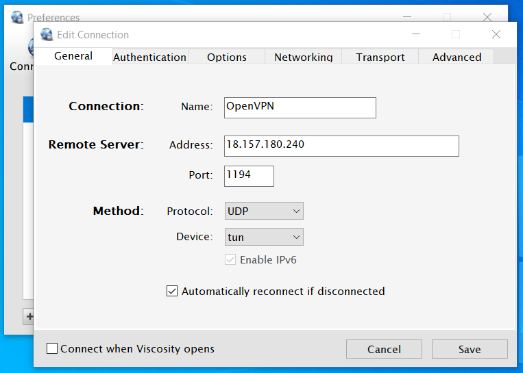
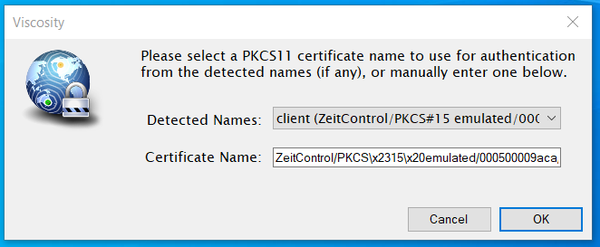

# Viscosity Client Configuration with OpenVPN

This guide will show to configure Viscosity client to connect to an OpenVPN instance, using a [Nitrokey Pro 2](https://shop.nitrokey.com/shop/product/nk-pro-2-nitrokey-pro-2-3) (or [Nitrokey Storage 2](https://shop.nitrokey.com/shop/product/nitrokey-storage-2-56)), and [PKCS#11 authentication](https://openvpn.net/community-resources/how-to/#what-is-pkcs11).

## Prerequisites

For this guide, you will need an OpenVPN remote server installed and configured for clients. For the purpose of this document, we have used OpenVPN 2.49 installed on a Debian 10 server, hosted by AWS. 

To read about how to configure OpenVPN to authenticate with Nitrokey Pro, you might consult the following [documentation](https://docs.nitrokey.com/storage/linux/openvpn-configuration-with-easyrsa.html), as we will just cover the way to configure the [Viscosity client](https://www.sparklabs.com/viscosity/) in this guide. 

You will also need the following:

- A Nitrokey Pro 2 (or Storage 2)
- Client's private key `client.key` loaded on the Nitrokey
- Client's certificate `client.crt` loaded on the Nitrokey
- The Certificate Authority file, i.e. `CA.crt` file used for your OpenVPN setup
- Optional: The shared secret key file, i.e. `ta.key` 

For more information on `PKCS#11` key management with OpenVPN, please consult OpenVPN's [documentation.](https://openvpn.net/community-resources/how-to/)

## Usage

1. Start Viscosity and create a new connection "openVPN" (you can name it as you wish)

2. Right click on the connection and click edit

3. Add your server's IP address and configure the port according to your configuration.

4. Under authentication, In `Type` scroll down to `SSL/TLS Client (PKCS11)`

5.  Select the CA file for your connection  

Optional: Select the `ta.key` in the `TLS-Auth` section

6.  Click the Add button next to the Providers field and select the `PKCS#11` module for your Nitrokey. Multiple providers can be specified, and for instance we will use `OpenSC`. 

On macOS, the most common location for modules to be found is in the /usr/lib directory. Please refer to the documentation included with your driver software for the location to use. OpenSC's module can be found at `/Library/OpenSC/lib/opensc-pkcs11.so`

On Windows, the most common location for libraries is either in `C:\Program Files` or `C:\Windows\System32`. OpenSC libraries are generally located at `C:\Program Files\OpenSC Project\OpenSC\pkcs11`. There may be more than one library available here, you can try each one or simply add both.

7.  Choose a retrieval method from the Retrieval drop down menu

  - If only one Nitrokey will ever be used on this computer, select `Use certificate name below`. If the Nitrokey is currently connected to the computer, click the `Detect` button for Viscosity to automatically fill in the Name field. Otherwise this field can be completed manually.

  - If in doubt, or if more than one Nitrokey may be used (i.e. multiple users), then select `Prompt for certificate name`. 

If `Prompt for certificate name` was selected, Viscosity will automatically detect the required key on the Nitrokey, using the specified PKCS#11 module/s. Select from any of the found devices, or enter the name of the `serialized id` to use manually. Again, the user should be prompted for a password/PIN if required.

8. Click the Save button and connect from your the main interface

## References

- [Using Tokens/Smartcards (PKCS#11)](https://www.sparklabs.com/support/kb/article/using-tokens-smartcards-pkcs-11/)
- [OpenVPN HOWTO](https://openvpn.net/community-resources/how-to/)

## Notes

- Viscosity is not free, and thus you might run into issues in using the free version. 
- We are considering the usage of [Pritunl](https://client.pritunl.com/) as a free and open alternative. 

